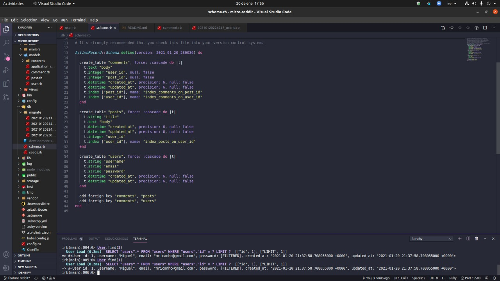

# Micro-reddit

In this project, I build an application similar to Reddit (called Micro-Reddit), just the backend, no front-end. The scope is to test the knowledge of active record, models, and associations. 


## Built With

- Ruby 2.7.2
- Ruby on Rails 6.1.1

### Setup

To run this project locally, please ensure you have Ruby and Ruby on Rails installed on your machine, then clone this repository by running.

```bash
git clone https://github.com/mricanho/micro-reddit.git
```

### Author

👤 **Miguel Ricaño*

- Github: [@mricanho](https://github.com/mricanho)
- Linkedin: [Miguel Ricaño](https://www.linkedin.com/in/mricanho/)

## Show your support

Give a ⭐️ if you like this project!

## Acknowledgments

- Microverse
- The Odin Project

## 📝 License

This project is [MIT](LICENSE.md) licensed.